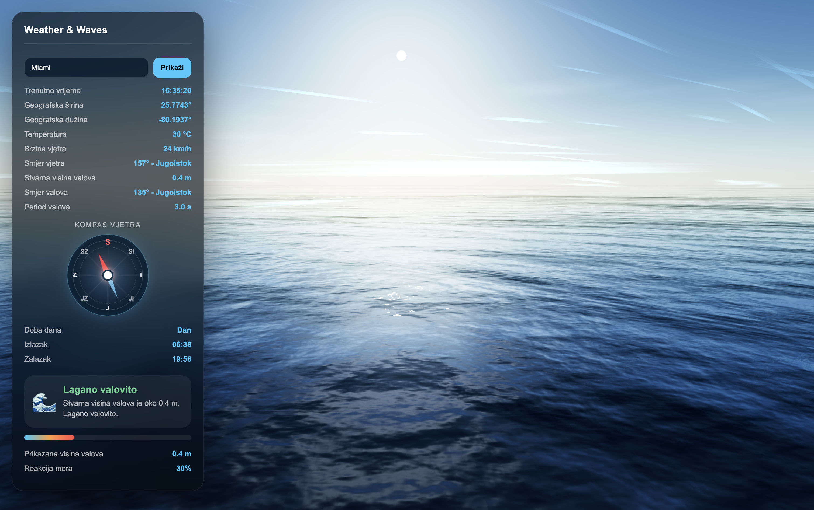
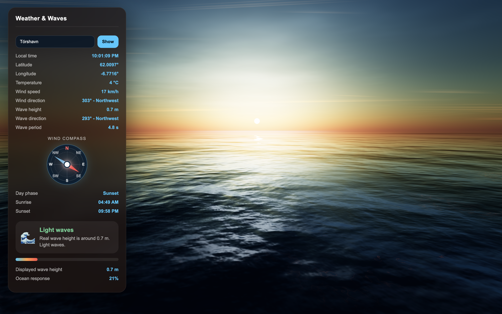
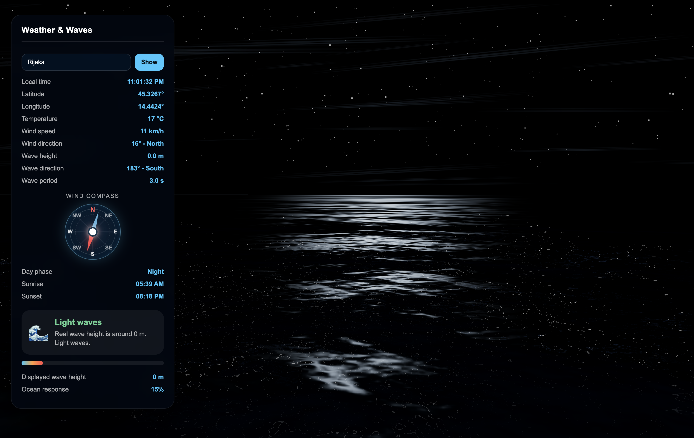

<div align="center">

<picture>
  <source
    media="(prefers-color-scheme: dark)"
    srcset="public/oceanis-light.svg"
  />

  <source
    media="(prefers-color-scheme: light)"
    srcset="public/oceanis-dark.svg"
  />

  
</picture>

# Oceanis

Real-time cinematic ocean simulation driven by live weather and marine conditions.

<br>


&nbsp;&nbsp;

&nbsp;&nbsp;


</div>

---

## Overview

Oceanis is a real-time environmental visualization project built with Three.js and WebGL.

The application combines live atmospheric and marine data with physically animated ocean surfaces, cinematic lighting, dynamic sky rendering and procedural environmental effects.

The simulation reacts to real-world conditions including:

- wind speed and direction
- wave intensity and marine state
- sunrise and sunset cycles
- local time zones
- atmospheric visibility
- storm intensity

---

## Features

- Real-time weather integration
- Dynamic ocean wave simulation
- Animated wind field rendering
- Automatic day and night transitions
- Procedural star field rendering
- Physically animated water geometry
- Interactive location search
- Cinematic lighting and atmospheric effects
- Marine condition visualization
- Responsive WebGL rendering pipeline

---

## Technologies

<div align="center">

| Technology | Purpose |
|---|---|
| Three.js | 3D rendering engine |
| WebGL | GPU rendering |
| JavaScript | Application logic |
| Vite | Development environment |
| Open-Meteo APIs | Weather and marine data |

</div>

---

## APIs

<div align="center">

| API | Usage |
|---|---|
| Open-Meteo Forecast API | Weather conditions |
| Open-Meteo Marine API | Wave and marine data |
| Open-Meteo Geocoding API | Location search |

</div>

---

## Project Structure

```txt
oceanis/
├── public/
│   ├── oceanis-dark.svg
│   ├── oceanis-light.svg
│   ├── day.png
│   ├── sunset.png
│   └── night.png
│
├── src/
│   ├── panel/
│   │   └── panelBuilder.js
│   │
│   ├── water/
│   │   └── weatherWaves.js
│   │
│   ├── weather/
│   │   └── weatherService.js
│   │
│   ├── main.js
│   └── style.css
│
├── index.html
├── package.json
└── README.md
````

---

## Installation

```bash
npm install
npm run dev
```

---

## Recommended Test Locations

<div align="center">

| Scenario               | Locations                   |
| ---------------------- | --------------------------- |
| Heavy ocean conditions | Nuuk, Reykjavik, Tórshavn   |
| Calm sea conditions    | Split, Zadar, Silba         |
| Night atmosphere       | South Pole, McMurdo Station |
| Sunset rendering       | Amsterdam, London, Oslo     |

</div>

---

## Rendering Pipeline

The environment rendering system includes:

* dynamic atmospheric scattering
* procedural ocean deformation
* real-time wind visualization
* adaptive marine simulation
* cinematic tone mapping
* procedural night sky rendering
* volumetric environmental transitions

---

## Development

```bash
npm run dev
npm run build
npm run preview
```

---

## License

<div align="center">

MIT License

</div>