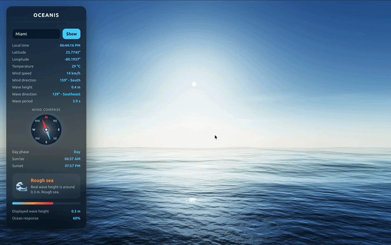
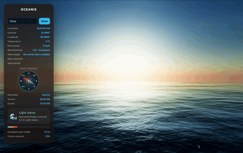
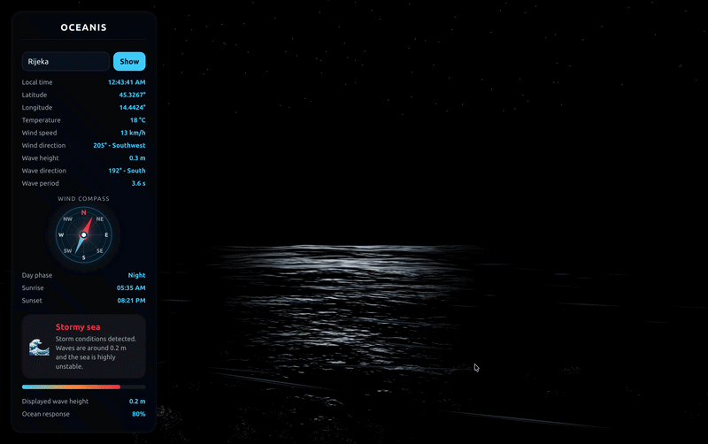

<div align="center">


# Oceanis

<div align="center">

[](https://realtime-weather-waves.vercel.app/)

[](https://threejs.org/)
[](https://www.typescriptlang.org/)
[]()

</div>

Real-time cinematic ocean and atmosphere simulation driven by live weather and marine conditions.

<br>


&nbsp;&nbsp;

&nbsp;&nbsp;


</div>

---

## Overview

Oceanis is a cinematic real-time ocean and atmospheric simulation built with Three.js, WebGL and TypeScript.

The project combines live weather and marine conditions with GPU accelerated ocean rendering, physically animated wave deformation and procedural environmental effects.

Oceanis dynamically reacts to real-world environmental conditions including:

- wind speed and wind direction
- marine wave intensity
- storm conditions
- sunrise and sunset cycles
- local timezone changes
- atmospheric visibility
- dynamic ocean state

The environment continuously adapts in real time to incoming weather and marine API data.

---

## Features

- Real-time weather integration
- Real-time marine condition simulation
- GPU accelerated ocean rendering
- Physically animated 3D ocean waves
- Custom vertex shader wave deformation
- Weather-reactive GPU wave simulation
- Dynamic wind field visualization
- Automatic day and night transitions
- Procedural night sky rendering
- Interactive location search
- Cinematic atmosphere rendering
- Dynamic fog and lighting system
- Responsive WebGL rendering pipeline
- TypeScript-based architecture
- Modular rendering system

---

## GPU Ocean System

Oceanis uses a GPU accelerated ocean rendering pipeline built on top of Three.js Water shaders.

The ocean surface is dynamically displaced inside the GPU vertex shader using:

- wave height uniforms
- storm intensity uniforms
- procedural sine wave deformation
- weather-reactive GPU calculations

Wave behavior dynamically reacts to:

- real marine wave height
- wind speed
- storm intensity
- ocean state classification

The rendering pipeline combines:

- CPU-side environmental logic
- GPU-side vertex displacement
- shader-based wave animation
- dynamic atmospheric rendering

This allows Oceanis to render large-scale animated ocean surfaces efficiently in real time.

---

## Technologies

<div align="center">

| Technology | Purpose |
|---|---|
| Three.js | 3D rendering engine |
| WebGL | GPU accelerated rendering |
| GLSL Shaders | GPU wave deformation |
| TypeScript | Application architecture |
| Vite | Development environment |
| Open-Meteo APIs | Weather and marine data |

</div>

---

## APIs

<div align="center">

| API | Usage |
|---|---|
| Open-Meteo Forecast API | Weather conditions |
| Open-Meteo Marine API | Marine and wave data |
| Open-Meteo Geocoding API | Location search |

</div>

---

## Architecture

Oceanis combines multiple real-time systems:

- Three.js rendering engine
- GPU shader-based ocean simulation
- TypeScript modular architecture
- Real-time Open-Meteo integration
- Atmospheric scattering system
- Dynamic marine state classification
- Procedural environmental effects

The rendering system separates:

- weather data acquisition
- marine state simulation
- GPU wave rendering
- UI rendering
- atmospheric lighting
- environmental transitions

---

## Project Structure

```txt
oceanis/
├── public/
│   ├── github.svg
│   ├── oceanis-dark.svg
│   ├── oceanis-light.svg
│   ├── day.png
│   ├── sunset.png
│   └── night.png
│
├── src/
│   ├── panel/
│   │   └── panelBuilder.ts
│   │
│   ├── water/
│   │   └── weatherWaves.ts
│   │
│   ├── weather/
│   │   └── weatherService.ts
│   │
│   ├── main.ts
│   └── style.css
│
├── index.html
├── tsconfig.json
├── package.json
├── vite.config.js
├── AI_CONTEXT.md
└── README.md
````

---

## Installation

```bash
npm install
npm run dev
```

---

## Build

```bash
npm run build
```

---

## Type Checking

```bash
npm run typecheck
```

---

## Preview Production Build

```bash
npm run preview
```

---

## Recommended Test Locations

<div align="center">

| Scenario               | Locations                   |
| ---------------------- | --------------------------- |
| Heavy ocean conditions | Nuuk, Reykjavik, Tórshavn   |
| Calm sea conditions    | Split, Zadar, Silba         |
| Night atmosphere       | South Pole, McMurdo Station |
| Sunset rendering       | Amsterdam, London, Oslo     |

</div>

---

## Rendering Pipeline

Oceanis includes:

* procedural ocean deformation
* GPU vertex wave displacement
* shader-based ocean deformation
* weather-reactive wave uniforms
* physically animated wave motion
* real-time wind visualization
* adaptive marine simulation
* dynamic atmospheric scattering
* cinematic tone mapping
* procedural star field rendering
* volumetric environmental transitions
* dynamic fog rendering
* weather-reactive lighting system

---

## Environmental Systems

### Ocean System

The ocean simulation dynamically reacts to:

* wind speed
* wave height
* storm intensity
* swell activity
* marine state transitions

The wave simulation modifies:

* distortion scale
* wave animation speed
* wave frequency
* water color
* fog density
* ocean turbulence

---

### Atmosphere System

The atmosphere system dynamically controls:

* sunlight intensity
* moon lighting
* sky scattering
* atmospheric fog
* star visibility
* sunrise and sunset transitions

Supported phases:

* night
* sunrise
* day
* sunset

---

### Wind Visualization System

Oceanis includes a procedural wind ribbon system that visualizes atmospheric flow in real time.

The system uses:

* transparent additive planes
* animated directional movement
* weather-reactive speed scaling
* dynamic atmospheric blending

---

## Performance

Oceanis uses GPU accelerated rendering techniques to maintain real-time performance while simulating:

* animated ocean deformation
* atmospheric transitions
* procedural star fields
* dynamic wind visualization
* weather-reactive lighting

The ocean simulation offloads wave deformation directly to the GPU shader pipeline, reducing CPU load and improving rendering scalability.

---

## Development Stack

* Three.js
* TypeScript
* WebGL
* GLSL
* Vite
* Open-Meteo APIs

---

## Future Improvements

Possible future upgrades include:

### Visual

* rain particle systems
* lightning simulation
* volumetric clouds
* ocean foam rendering
* spray particles
* SSR reflections
* cinematic post-processing

### Physics

* Gerstner waves
* FFT ocean simulation
* buoyancy physics
* dynamic foam generation
* GPU compute wave simulation
* WebGPU compute shaders

### UI

* favorite locations
* marine radar
* tide system
* swell graphs
* weather icons
* historical weather playback

---

## License

Oceanis is protected under a custom non-commercial license.

Commercial usage, redistribution, resale,
or use in paid products or services is prohibited
without explicit written permission from the author.

© 2026 Armin Lišić

---

</div>